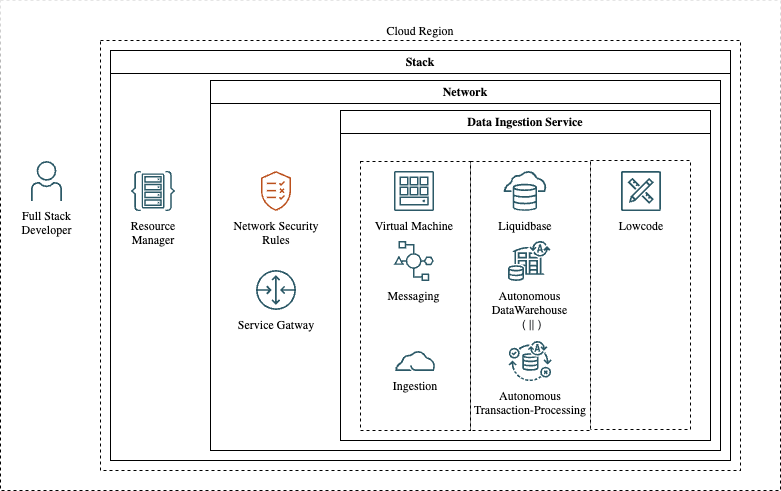

# Introduction

# Low Code Gaming Data Analytics with Oracle Resource Manager and APEX 

## Welcome to first of the FormulaPi kit series!
The Formula Pi Demo Kit is designed to provide a hands-on experience with Oracle technology, demonstrating how it can be used to solve real-world business problems. This kit showcases a modern, on-demand, UDP Data Ingestion OCI console configurable stack that includes a Database, Networking, VM, and Messaging components.

## FormulaPi kit lab structure:
The hands-on lab will take you through the following steps:
1. ***Lab 1*** - Deploying Infrastructure with Resource Manager
1. ***Lab 2*** - Setting up the Data Ingestion Engine
1. ***Lab 3*** - Exploring Data in APEX

  

Future Labs will cover topics such as:
- JAVA Data Ingestion
- Container Instances
- OCI Stream
- Data Science
- API Management

## Acknowledgements
* **Author** - <Wojciech Pluta, Immersive Lead, DevRel>
* **Contributors** -  <Jason Lowe, Oracle>
* **Last Updated By/Date** - <Name, Month Year>
