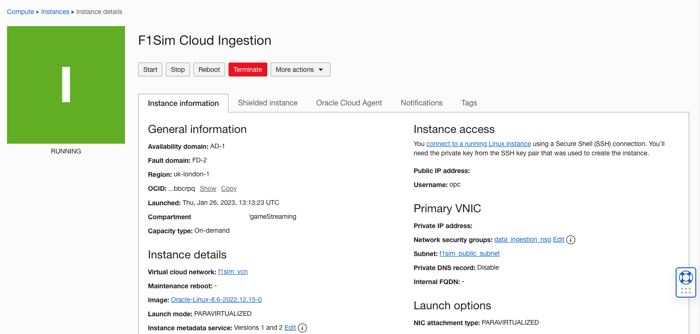
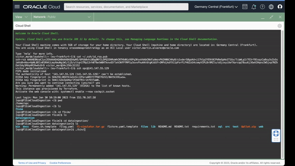
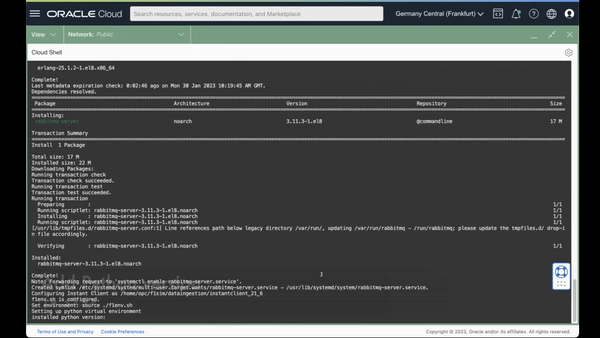
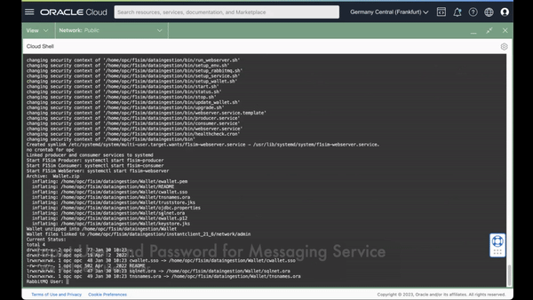
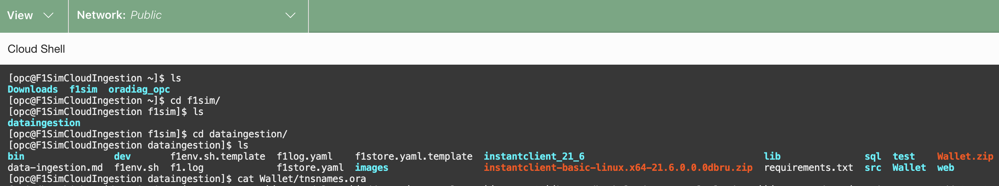
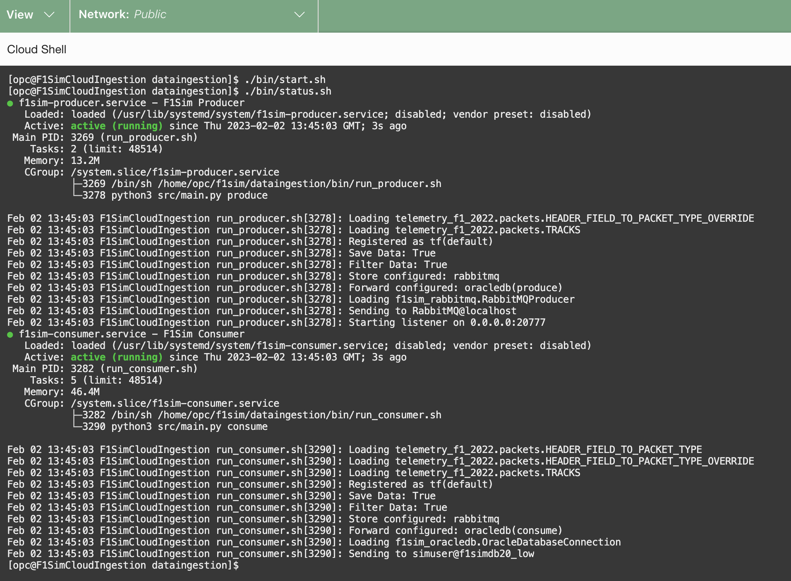

# Data Ingestion Configuration

## Introduction

In this section we will review Data Ingestion application that was deployed with "Resource Manager" in previous lab.

Optionally you can run Data Ingestion locally on an edge devices like Raspberry Pi.

Estimated Lab Time: 10 minutes

### Objectives

In this workshop, you will learn about:

* F1 data packets high level flow
* Data Ingestion setup

### Prerequisites

This lab assumes you have:

* An Oracle Cloud account
* All previous labs successfully completed
* (Optional) Edge device like Raspberry Pi

### Data Flow

  

### Official Data Packet definition

For latest packet definition please visit [here](https://racinggames.gg/f1/f1-22-update-117-patch-notes/)

## Task 1: Log in to your VM via SSH

1. In Cloud Console navigate to _Instance_ and _Compute_
2. Copy IP address
     
3. Log in using Cloud Shell or other ssh client

## Task 2: Data Ingestion configuration and authentication

1. In terminal Run:  

      ```bash
      <copy>$F1SIM_HOME/bin/install_di.sh</copy>
      ```

    

2. Add your Python version i.e. `3.9`  
     
3. Create RabbitMQ login and password (We will need them later)  
   
4. Once completed duplicate _f1store.yaml.template_

      ```bash
      <copy>cp f1store.yaml.template f1store.yaml</copy>
      ```

5. Configure _f1store.yaml_ with text editor like vim or nano  

      ```bash
      <copy>vim f1store.yaml</copy>
      ```

6. Add following to your .yaml config file:
   1. _gamehost_ - string
   2. _devicename_ - string
   3. _version_ - integer game packet configuration
      
   4. Add RabbitMQ details from step 5 _rmqusername_, _rmqpassword_
      
   5. _dbusername_ - from your stack
   6. _dbpassword_ - from your stack
   7. _dbwalletpassword_ - from your stack
   8. _dburl_ in Cloud Shell Run

      ```bash
      <copy>cat Wallet/tnsnames.ora</copy>
      ```

    

7. To start services:

      ```bash
      <copy>./bin/start.sh</copy>
      ```

     

## Task 3: Adding test data

1. Next, let's load test data:

      ```bash
      <copy>cd test/data && tar xzvf hol-data.tar.gz && cd ../.. && . f1env.sh && python3.9 test/main.py localhost test/data/miami</copy>
      ```

You may now **proceed to the next lab**


## Acknowledgements

- **Author/Contributors** -  Stuart Coggins, Wojciech Pluta, Jason Lowe
- **Contributor** - Oracle LiveLabs Team
- **Last Updated By/Date** - <Wojciech, May 2023>