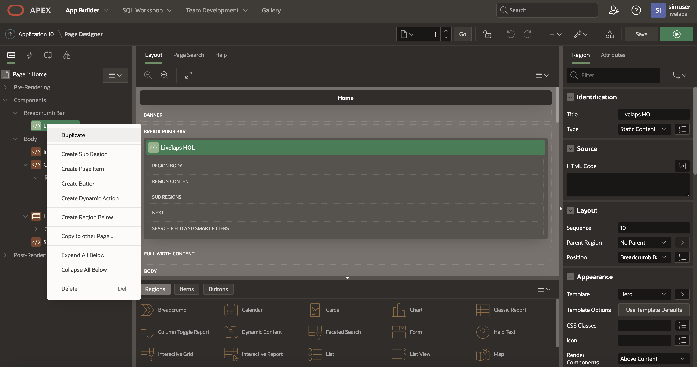

# Import and customize Oracle APEX app

## Introduction

In this section, we will be discussing the creation of a presentation layer for our eSports data. To accomplish this, we will be utilizing Oracle's Lowcode environment known as APEX. APEX is an extremely powerful tool that simplifies and accelerates the development lifecycle due to its What-You-Write-Is-What-You-Get (WYWASIG) interface.

Throughout this section, we will explore how to import an application into APEX and personalize it using CSS and SQL conditional formatting. This will allow us to create a visually appealing and user-friendly interface for our eSports data, making it easily accessible and understandable for anyone who needs to interact with it. With APEX, we can streamline the development process and focus on delivering a top-quality product that meets the needs of our users.

Estimated Time: 40 minutes

### Objectives

In this lab, you will learn how to:

* Import APEX app
* Use CSS to customize the look

### Prerequisites

This lab assumes you have:

* An Oracle Cloud account
* All previous labs successfully completed
* APEX workspace login details

### What is an APEX Workspace?

An APEX Workspace is a logical domain where you define APEX applications. Each workspace is associated with one or more database schemas (database users) which are used to store the database objects, such as tables, views, packages, and more. These database objects are generally what APEX applications are built on top of.

## Task 1: Install custom app in Oracle APEX

1. Download "Formula-Pi" APEX app [files](https://github.com/oracle-devrel/FormulaPi_Lab1_deployment/releases/download/v1.0/APEXapps.zip)
2. Copy the APEX direct link from the Resource Manager Output and paste it into your browser
    
3. Log into your Oracle APEX instance.  
   
4. Navigate to _App Builder_ > _Import_  

5. Drag and drop the _f100.sql_ file from your local unzipped apexapps.zip into the designated area.

6.  Click _Next_ to import the file
   
7. Click _Next_ for install options, leaving all others as default
8. Click _Install Application_
   

### Access your APEX app

1. Click _Run_ Application
   
2. Sign in as APEX user

1. In the “Track” form field, enter the name of the track on which you've been racing - this name is set by the Game. Press Enter.
2. A simple Leaderboard report is created  

1. You can view the SQL used to create the Leaderboard in the footer region, or by editing the page
2. Explanation of the SQL:
    1. Extracts Laptime data based on the track you selected in the form. The data is then ranked and formatted for display.
    2. Extract Laptime Data: Selects the Lap Timing from the “LAPTIME” table, including the Session data and filters based on the Selected Track (:p1_track) on the Game Version being 2022 and only Valid Laps.
    3. Rank Lap times: Lap times have 3 rankings in this case
    4. Session Rank. If you do 5 laps in one “session”, this will be the order of the timing for that session only.
    5. Event Rank. This will be a ranking for ALL sessions for each Gamehost.
    6. Driver Rank provides a ranking of laptimes for a given driver’s name. In this case we are defaulting to “Driver” (and Team Name).
    7. To update the Leaderboard report and leverage the Ranking as a filter, you can set the WHERE clause here: (Un comment the WHERE)

The next section formats the Fields for display. Laptimes are in Milliseconds and need to be converted to Minutes:Seconds.Milliseconds. Sector Times are formatted to 3 decimal places. Gap & Interval are calculated based on the time difference between the fastest time (GAP) and the previous time (INTERVAL).

## Task 2: Add CSS to Application

### Duplicate core App

1. From the App Builder page, click to edit the Application.
2. Click _Copy this Application_

3. Enter name:
```
<copy>Livelaps HOL+CSS</copy>
```

4. Click _Next_  

1. Click _Copy Application_  

1. New Application is loaded into the App Builder Edit Application Page

### Upload CSS files

1. Click _Shared Components_

2. Click _Static Application Files_ under “Files and Reports”

3. Click _Create File_ and drag or choose _apex-hol-min.css_ from you local folder

4. Review the CSS and then click _Save Changes_ and back to _Static Application Files_

5. Repeat same process for _Livelaps HOL.css_

6. Great Work! Note that APEX created _MIN_ version of the Livelaps HOL css file.

7. Please make note of following two URL's - we will need them later.
   * _apex-hol-min.css_ file. URL =`#APP_IMAGES#apex-font-min.css`
   * _LiveLaps HOL.css_ file. URL = `#APP_FILES#Livelaps HOL.css`

## Task 3:  Apply CSS Template to Your App

1. Navigate to the Shared Components screen. Find section called “User Interface” and click on _Themes_

2. Locate and click on _Universal Theme – 42*_ to edit this theme

3. In the next screen, look for the _Styles_ option and click on it

4. You should now see a list of styles applied to your theme. To add a new style, click on the _Add Style_ button

5. A form will appear, asking for details about the new style you want to add. Fill in the following details:
   * Name:
        ```
        <copy>eSports</copy>
        ```

   * Is Current: Slide the toggle to 'ON'.
   * Add CSS to File URLs: Paste the following:
        ```
        <copy>#APP_IMAGES#apex-font-min.css</copy>
        ```

1. Once you've filled in these details, click on the 'Create' button.
   
2. Click _Apply Changes_
   

## Task 4: Changing App formatting to our Custom CSS

1. Begin by navigating to the _Shared Components_  
    
2. Under the 'User Interface' category, click on _User Interface Attributes_
    
3. On the _User Interface Attributes_ scroll down to the CSS section. Enter the Reference (URL) into the File URLs box:
        ```
        <copy>#APP_FILES#Livelaps HOL.css</copy>
        ```


4. Having entered the URL, confirm your changes by clicking on _Apply Changes_. This action will ensure the CSS is applied to your app.
5. To view the changes, click _Run_ to inspect your freshly styled dashboard


## Task 5: Styling Your Leaderboard App

1. Begin by navigating to the _Edit Application_ option on the App Builder page.
2. Open _1 – Home_ in Edit Mode

3. In the _Appearance_ section, find the _Page template_ dropdown menu. Select _Minimal (Ultra light)_ from the drop down. This action applies our custom, minimal page template to the home page

4. While still in the _Appearance_ section, find the _CSS Classes_ field. Enter _eSports_ into this field to apply the corresponding CSS styling.
5. Click _Save_ to confirm your changes  

6. Our design doesn't require a Breadcrumb bar, so it can be removed. Locate the _Breadcrumb Bar_ and select _Livelaps HOL_. Once selected, delete it. You can do this by right-cliking and choosing _Delete_, or simply by pressing the _Delete_ key on your keyboard

7. Click _Save_ to complete this task

## Task 6: Implementing dynamic CSS to our Leaderboard App

1. We will introduce CSS inside our SQL code to provide dynamic formatting to the leaderboard. This will be achieved through conditional formatting in the SELECT statement and by using columns as CSS directives. Copy and paste the following SQL code snippet:
        ```sql
        <copy>SELECT DISTINCT RANK() OVER (ORDER BY lt) P,M_SESSION, M_LAP LAP, LT,session_rank, event_rank, driver_rank, short_driver,team,  
        to_char(extract(MINUTE FROM numtodsinterval(LT/1000, 'SECOND')), 'fm0') || ':' || to_char(extract(SECOND FROM numtodsinterval(LT/1000, 'SECOND')), 'fm00.000') lap_time_dsp,
        to_char(S1/1000, 999.999) S1, to_char(S2/1000, 999.999) S2, to_char(S3/1000, 999.999) S3,
        CASE WHEN (LT- (MIN(LT) OVER ()))  = 0 THEN  ''
        ELSE to_char((LT- (MIN(LT) OVER () ))/1000, '999.999') END as gap,
        CASE WHEN NVL((LT - lag(lt,1) OVER (ORDER BY lt))/1000, 0)  = 0 THEN  ''
        ELSE to_char(NVL((LT - lag(lt,1) OVER (ORDER BY lt))/1000, 0), '999.999') END as interval, 
        CASE WHEN S1 > min(S1) OVER () THEN    'time-yellow' ELSE    'time-purple' END as s1_col,
        CASE WHEN S2 > min(S2) OVER () THEN    'time-yellow' ELSE   'time-purple' END as s2_col,
        CASE WHEN S3 > min(S3) OVER () THEN    'time-yellow' ELSE   'time-purple' END as s3_col,
        '<span class="l_vert txt-' || TEAM ||'"></span><span class="drivern txt-wht u-textUpper hidden-md-down">&nbsp;' || DRIVER || '</span><span class="drivern txt-wht u-textUpper hidden-lg-up">&nbsp;' || SHORT_DRIVER || '</span>' Driver
        FROM 
        (
        SELECT l.M_SESSION, l.M_GAMEHOST, l.TRACKID, l.M_LAP M_LAP, l.S1, l.S2, l.S3, l.LT,
        RANK() OVER (PARTITION BY l.m_session ORDER BY LT) session_rank,
        RANK() OVER (PARTITION BY l.m_gamehost ORDER BY LT) event_rank,
        RANK() OVER (PARTITION BY 'driver' ORDER BY LT) driver_rank,
        'Driver' driver, 'DRI' SHORT_DRIVER, 'rbr' team,  0 R_STATUS
        FROM (
            SELECT l."DATA$m_session" M_SESSION,
            l."DATA$m_gamehost" M_GAMEHOST,
            l."DATA$m_trackid" TRACKID,
            l."DATA$lap_num" M_LAP,
            l."DATA$sector1_in_ms" S1,
            l."DATA$sector2_in_ms" S2,
            l."DATA$sector3_in_ms" S3,
            l."DATA$lap_time_in_ms" LT
            FROM "LAPTIME" l
            WHERE 
            l."DATA$m_trackid" = :P1_TRACK  -- Filter by Track
            AND l."DATA$m_packet_format" = 2022  -- Filter by Game Version
            AND l."DATA$invalid_lap" = 0 -- Filter by Valid Laps (0) or remove alltogether for ALL laps
        ) l
        )
        ORDER BY P
        FETCH FIRST 20 ROWS ONLY;</copy>
        ```

2.  Navigate to the _Leaderboard_ and paste the copied SQL statement into the _SQL Query_ section, which is located on the right-hand side of your screen.
  
3. Next, expand _Leaderboard_ region _Columns_  
  
4. Click on the _DRIVER_ column.
5. In the _Security_ section, find _Escape Special Characters_ and switch it OFF  
  
6. Now, select the _S1_ column and scroll to the _HTML Expression_ under _Column Formatting_. Here, input the following code:
        ```
        <copy><span class="laptime #S1_COL#">#S1#</span></copy>
        ```
7. Repeat the process from step 6 for both the _S2_ and _S3_ columns. Use corresponding codes from below:

* _S2_:
        ```css
        <copy><span class="laptime #S2_COL#">#S2#</span></copy>
        ```
* _S3_:
        ```css
        <copy><span class="laptime #S3_COL#">#S3#</span></copy>
        ```

    

9. After these modifications, click _Save_ to confirm your changes
10. We also don’t need all the columns in our Leaderboard, so proceed to hide the unnecessary ones:  
    * Hide _LT_ and _Team_
    * Hide _`S1_COL`_, _`S2_COL`_, _`S3_COL`_  
      
11. To review the modifications you've made, re-run your Leaderboard App. Please remember to set your chosen track.
      

## Task 7: Removing the Gridline

1. From the _Edit Application_ in the App Builder page, select Page _1 – Home_ to open it in Edit Mode  

2. Click on the _Leaderboard Region_
3. In  _Appearance_ section, click on _Template Options_ button  

4. From the dropdown menu under Style choose “Remove Borders”. Click _OK_  

5. With Leaderboard Region still selected, navigate to the _Attributes_ tab  

6. Click _Template Options_ button under _Appearance_ to open the options popup
7. Set Row Highlighting to _Disable_  

8. Find the _Report Border_ setting and set it to _No Borders_
9. Click _OK_ to confirm your selections
10. Click _Save_ to ensure all changes are stored
11. Now, run your dashboard to see the changes  
   

Congratulations, you've successfully completed the labs! Great job! This exercise has equipped you with the skills to create and modify dynamic CSS within your app for a more optimized user experience. Happy coding!

## Acknowledgements

* **Author/Contributors** -  Stuart Coggins, Wojciech Pluta, Jason Lowe
* **Contributor** - Oracle LiveLabs Team
* **Last Updated By/Date** - Wojciech, May 2023
